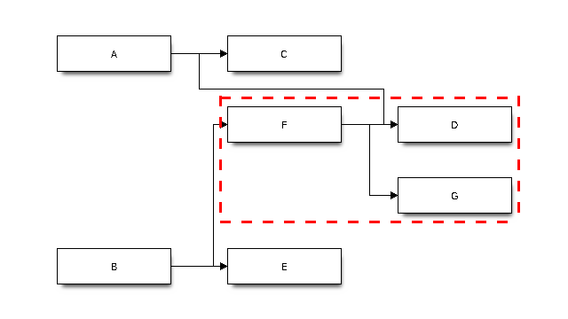

class: center, middle

# Build 🏗, Package 📦, Distribute 🎉

Daniel Maslowski |
 [@orangecms](https://twitter.com/orangecms) |
 [orangecms](https://github.com/orangecms)

---

# ToC

1. Introduction
2. Distribution
3. Packaging
4. Building
5. Getting Started

---

class: center, middle

## Introduction

---

### Software

--

💻 +🕹  = ❤

--

--

💻 + 📦 = 💕

___
[`https://www.wikihow.com/Find-a-Lost-Computer-Game`](https://www.wikihow.com/Find-a-Lost-Computer-Game#/Image:Find-a-Lost-Computer-Game-Step-4.jpg)

---

### Package Management

--

- installation

--

- configuration

--

- tracking / database

--

- upgrading

--

- removal

---

class: center, middle

## Distribution

---

### OS Distributions
___

####  FreeBSD (freezes, except TrueOS)
  1. Binary repository
  2. Ports tree

--

####  Arch Linux (rolling release GNU/Linux)
  1. Binary repositories
  2. AUR

--

####  Gentoo (rolling release meta-distro)
  1. Portage
  2. Overlays

---

### CLI Tools
___

#### 
  -  `pkg`

--

#### 
  - `pacman`

--

#### 
  - `emerge`

---

### Synchronization
___

#### 
  - `pkg update`
  - [`portsnap fetch update`](https://www.freebsd.org/doc/handbook/ports-using.html)

--

#### 
  - `pacman -Sy`

--

####  
  - `emerge --sync`
  - `layman -S`

---

### Automated Installation
___

#### 
  - `pkg install package-name`

--

#### 
  - `pacman -S package-name`

--

####  
  - `emerge package-name`

---

### Manual Installation
___

#### 
  - `make install`

--

#### 
  - [`makepkg`](https://wiki.archlinux.org/index.php/Makepkg)

--

####  
  - `ebuild package-name-1.2.3.ebuild merge`

---

class: center, middle

## Packaging

---

### Steps

- fetch / download sources
- verify integrity
- calculate version
- unpack
- prepare / patch
- configure
- compile
- test
- install
- archive

---

### Porting and Portability

--

- [POSIX](http://pubs.opengroup.org/onlinepubs/9699919799/)
- [Linux Standard Base](https://wiki.linuxfoundation.org/lsb/start)

--

- [`Makefile` conventions](https://www.gnu.org/prep/standards/html_node/Makefile-Conventions.html#Makefile-Conventions)
  - [`PREFIX`](https://www.freebsd.org/doc/en/books/porters-handbook/porting-prefix.html)
  - [`DESTDIR`](https://www.dwheeler.com/essays/automating-destdir.html)
  - [targets](https://www.gnu.org/prep/standards/html_node/Standard-Targets.html#Standard-Targets)

--

- configure scripts, autotools, `cmake`, `qmake`

--

- `diff` / `patch`, `sed`, `awk`, `grep`

--

- platform-specific conventions and utilities
  - access controls, sandboxing, udev rules, AppArmor profiles, SELinux
  - init system files (OpenRC, systemd, etc.)
  - file system hierarchy (e.g., `/usr/local` in BSDs)

---

### Metadata

- name
- version
- license
- description
- source URLs
- project homepage
- dependencies

---

### Dependencies

- shared libraries, runtimes, static resources (assets)
- versions, releases
- graph
  - resolution
  - SAT-solver

---

### Helper Tools

- skeleton files
- metadata files and utilities
  - `mksrcinfo`
  - `metadata.xml`
- checksum generators
  - `updpkgsums`
  - `ebuild foo.ebuild manifest`
- package linters

---

### Linters / QA Tools

####  [Portlint](https://www.freebsd.org/doc/en/books/porters-handbook/testing-portlint.html)

####  [Namcap](https://wiki.archlinux.org/index.php/namcap)

####  [`pkgcheck`](https://readthedocs.org/projects/pkgcheck/) (used for PRs in CI)

#### [`rpmlint`](https://github.com/rpm-software-management/rpmlint)

#### [`lintian`](https://lintian.debian.org/)

---

class: center, middle

## Building

---

### General Tools

- module system
- taskrunner
- compiler
- linker

---

### Specific Dependency Managers

--

- JavaScript
  - npm
  - bower

--

- Ruby
  - gem
  - bundler

--

- Python
  - pip

--

- Java
  - maven

---

class: center, middle

## Getting Started

---

### Guides, Handbooks, Standards

####  [FreeBSD Porter's Handbook](https://www.freebsd.org/doc/en_US.ISO8859-1/books/porters-handbook/)

####  [OpenBSD Porter's Handbook](http://www.openbsd.org/faq/ports/index.html)

####  [Arch packaging standards](https://wiki.archlinux.org/index.php/arch_packaging_standards)

####  [Gentoo Development Guide](https://devmanual.gentoo.org/)

####  [Creating RPM Packages with Fedora](https://fedoraproject.org/wiki/How_to_create_an_RPM_package)

---

class: center, middle
# Thanks, that's it! 😸
